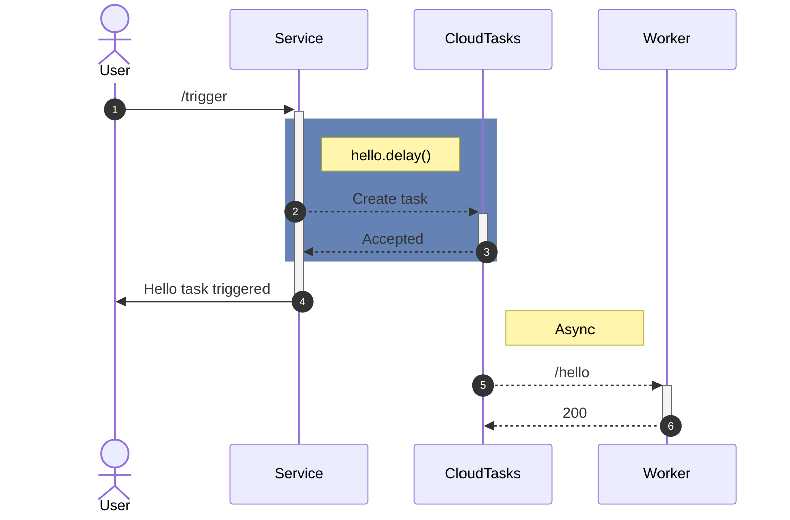

# FastAPI GCP Tasks

Strongly typed background tasks with FastAPI and Google Cloud Run, Tasks and Scheduler.

Your tasks are regular FastAPI endpoints. Trigger one later with `.delay()`, or on a cron schedule with
`.scheduler()` — Cloud Tasks and Cloud Scheduler make the HTTP calls back to your service.

## Key features

- **Strongly typed tasks.**
    - Fail at invocation site to make it easier to develop and debug.
    - Breaking schema changes between versions will fail at task runner with Pydantic.
    - Fully type-checked public API (PEP 561 `py.typed`), with opt-in static typing for
      `.delay`/`.scheduler` — see [Type safety](guide/type-safety.md).
- **Familiar and simple public API.**
    - `.delay` method that takes the same arguments as the task.
    - `.scheduler` method to create recurring jobs.
    - Async variants (`AsyncDelayedRouteBuilder` / `AsyncScheduledRouteBuilder`) so `await .delay()`
      never blocks the event loop.
- **Tasks are regular FastAPI endpoints on plain old HTTP.**
    - `Depends` just works!
    - All middlewares, telemetry, auth, and debugging solutions for FastAPI work as is.
    - Host task runners independent of GCP. If Cloud Tasks can reach the URL, it can invoke the task.
- **Save money.**
    - Task invocation with GCP is [free for the first million, then $0.40/million](https://cloud.google.com/tasks/pricing) —
      almost always cheaper than running a RabbitMQ/Redis/SQL backend for celery.
    - Jobs cost [$0.10 per job per month irrespective of invocations; 3 jobs are free](https://cloud.google.com/scheduler#pricing) —
      either free or almost always cheaper than an always-running beat worker.
    - If this cost ever becomes a concern, the `client` can be overridden to call any gRPC server with a
      compatible API, like [this emulator](https://github.com/aertje/cloud-tasks-emulator) used for local development.
- **Autoscale.**
    - With a FaaS setup, your task workers can autoscale based on load.
    - Most FaaS services have free tiers, making it much cheaper than running a celery worker.

## The concept

[Cloud Tasks](https://cloud.google.com/tasks) allows us to schedule an HTTP request in the future.

[FastAPI](https://fastapi.tiangolo.com/tutorial/body/) makes us define a complete schema and params for an
HTTP endpoint.

[Cloud Scheduler](https://cloud.google.com/scheduler) allows us to schedule recurring HTTP requests in the
future.

FastAPI GCP Tasks works by putting the three together:

- Cloud Tasks + FastAPI = partial replacement for celery's async delayed tasks.
- Cloud Scheduler + FastAPI = replacement for celery beat.
- FastAPI GCP Tasks + Cloud Run = autoscaled delayed tasks.

## Where to go next

- [Getting started](getting-started.md) — install and run your first delayed task locally.
- [Delayed tasks](guide/delayed-tasks.md) and [Scheduled tasks](guide/scheduled-tasks.md) — the two core
  building blocks.
- [Async usage](guide/async.md) — non-blocking task triggers from async endpoints.
- [Type safety](guide/type-safety.md) — statically checked `.delay()` calls.
- [API reference](api/route-builders.md) — full signatures, generated from the source.

## License & disclaimer

This project is licensed under the terms of the MIT license. It was forked from
[fastapi-cloud-tasks](https://github.com/Adori/fastapi-cloud-tasks) under the MIT license; all changes made
to the original project are also licensed under the MIT license.

This project is neither affiliated with, nor sponsored by Google.
